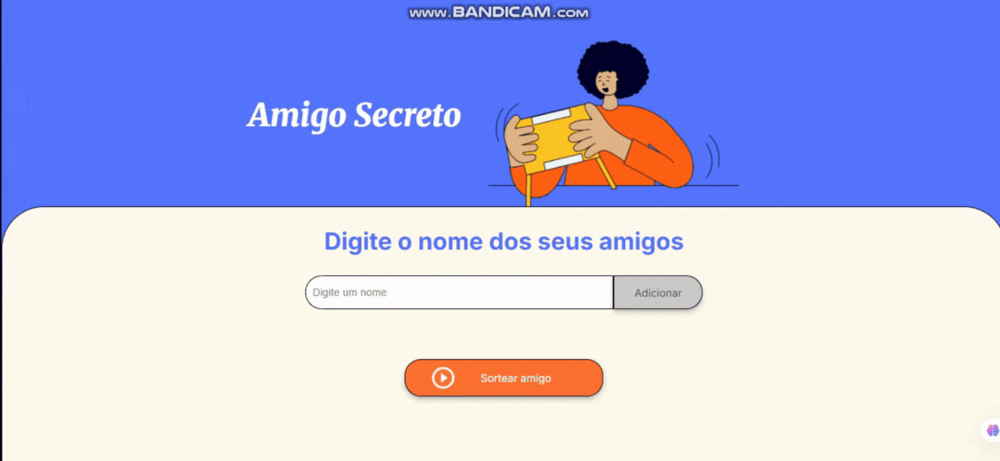

<h1 align="center">Sorteio de Amigo Secreto🙋‍♀️🙋‍♂️</h1>

  
  

<h2>❓Descrição</h2>
Projeto desenvolvido para o primeiro desafio ONE. Realiza o sorteio de um amigo secreto a partir de uma lista de nomes passada pelo usuário.

<h2>⚙️Funcionalidades</h2>
<ul> 
  <li><b>Funcionalidade 1:</b> Entrada de dados pelo usuário via interface.</li> 
  <li><b>Funcionalidade 2:</b> Previne entradas inválidas.</li>
  <li><b>Funcionalidade 3:</b> Lista de nomes digitados visível para o usuário.</li>
  <li><b>Funcionalidade 4:</b> Exibe o resultado de forma clara.</li> 
</ul>

